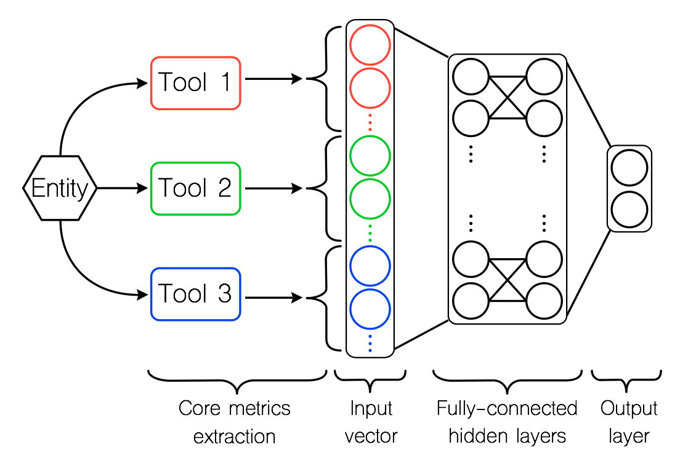

# SMAD (SMart Aggregation of Anti-pattern Detectors)
A machine-learning based ensemble method to aggregate various anti-pattern detection tools on the basis of their 
internal detection rules and, thus, improve detection performances.

SMAD is implemented for the detection of **God Class** and **Feature Envy**.

## Overview
The key idea behind SMAD is to combine various anti-pattern detection tools by computing
their core-metrics for each input instance and use these metrics to feed a machine-learning based classifier. 
First, for each anti-pattern considered in this study, we selected three state-of-the-art detection tools. 
These tools respectively rely on:
* **Rule Cards:** Affected entities are identified using a combination of source-code metrics designed to reflect the formal definition of the anti-patterns.
For this category, we selected DECOR for God Class and InCode for Feature Envy detection.
* **Historical Information:** Affected entities are identified via an analysis of change history information derived from versioning systems. 
For this category, we used HIST for both God Class and Feature Envy detection.
* **Refactoring Opportunities:** Anti-patterns are detected by identifying the opportunities to apply their corresponding refactoring operations. 
For this category, we used the refactoring operations Extract Class and Move Method provided by JDeodorant, respectively for God Class and Feature Envy detection.

Then, we selected the core-metrics, i.e., metrics that reflect best the internal decision process of each tool, as input metrics for our model. 
Finally, we perform classification through a logistic regression. 
Our model is a fully-connected neural-network composed of *tanh* hidden layers connected to a *softmax* output layer.

  

  
